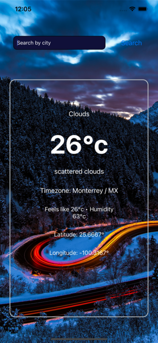

# BasicWeatherApp

This ios app uses the https://openweathermap.org/api/one-call-api#data API for its data, this data is a One-call API, and of course it's free but limited, it provides the Current weather in celcius, Humidity, Timezone.

## Installation (for standard modern project) and run project

```bash
yarn global add expo-cli
```

```bash
yarn add
```

```bash
yarn start
```

## Demo



## Stack

<p align="left"> 
